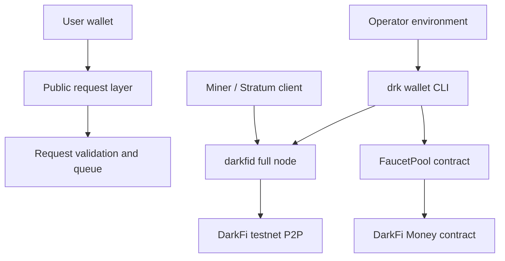

# Architecture

This repository is a public engineering layer for a DarkFi testnet faucet.

It is not a copy of a maintainer machine. It contains only source, models,
specifications, and public process needed for contributors to continue safely.

## System Layers

## Responsibilities

### FaucetPool

Final authority for:

- custody policy;
- claim amount;
- wallet cooldown;
- daily pool limit;
- pause/resume;
- emergency withdrawal.

### Public App Or API

Convenience layer only.

It may:

- validate request shape;
- rate-limit requests;
- queue work;
- show public status.

It must not:

- hold maintainer wallet files;
- hold private keys;
- execute `drk` with maintainer state;
- bypass FaucetPool limits.

### Operator Environment

Temporary controlled environment for:

- deploy;
- top-up;
- resume;
- claim test;
- wallet scan;
- proof collection.

Operator material is private and must not be committed.

## Proof Boundary

A faucet claim is proven only when:

1. transaction confirms on-chain;
2. `fetch-tx` can find it;
3. wallet scan observes receipt;
4. duplicate claim is rejected.

Local pending state is not enough.

## Current Direction

Use the clean-room faucet cycle. Do not depend on historical maintainer runtime
state.

